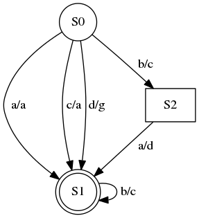
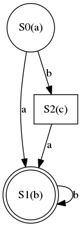
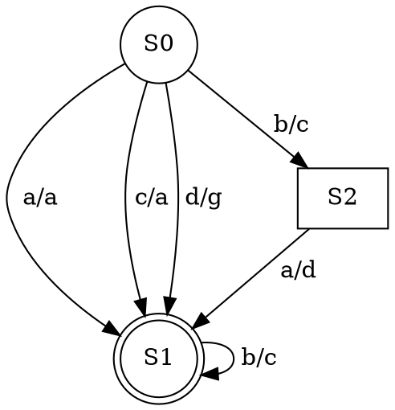

# Лабораторная №1: автоматы Мили и Мура

Срок выполнения и сдачи &mdash; не более месяца после выдачи задания.

### Задания

Варианты задания (можно выполнить несколько):

- **(1.1)** Добавить к примеру (см. ниже) чтение и генерацию диаграммы (в `*.dot` и `*.png`) для автомата Мура
- **(1.2)** Добавить к автоматам Мили и Мура отображение терминального состояния двойным кругом (`shape=doublecircle` в Graphviz)



- **(1.3)** Реализовать преобразование автомата Мили в эквивалентный автомат Мура и печать полученного автомата Мура в текстовый формат, спецификация которого изложена выше

- **(1.4)** Реализовать преобразование автомата Мура в эквивалентный автомат Мили и печать полученного автомата Мили в текстовый формат, спецификация которого изложена выше

- **(1.5)** Создание автомата Мили с минимальным количеством состояний, эквивалентного данному автомату Мили

- **(1.6)** Создание автомата Мура с минимальным количеством состояний, эквивалентного данному автомату Мура

### Оценка задания

Каждый пункт от 1.1 до 1.6 оценивается отдельно, от 1 до 3 баллов.

- **1 балл**, если код работоспособный и нет сомнений в авторстве
- **2 балла**, если после ревью кода устранены все замечания
- **3 балла**, если в дополнение к остальному код покрыт тестами (через внешние bat, shell, python скрипты, либо через boost.test).

### Автомат Мура

Есть [пример с разбором автомата Мура на C++](../tutorials/fsm-graphviz.md)

Спецификация текстового формата:

- на первой строке записано "`<MR>`"
- на второй строке два числа: количество состояний `V` и количество переходов `N`.
- на третьей строке `V` символов через пробел, это выходные символы для каждого состояния 1-го до `V`-го
- на последующих `N` строках записаны переходы в формате "`x y z`", где x &mdash; индекс исходного состояния, y &mdash; входной символ (буква из латинницы), z &mdash; индекс нового состояния.

Пример ввода:
```
<MR>
3 4
a b c
0 a 1
0 b 2
1 b 1
2 a 1
```



Содержимое файла "fsm.dot":


### Автомат Мили (Meale)

Спецификация текстового формата:

- на первой строке записано "`<ML>`"
- на второй строке два числа: количество состояний `V` и количество переходов `N`.
- на последующих `N` строках записаны переходы в формате "`x y z w`", где x &mdash; индекс исходного состояния, y &mdash; входной символ (буква из латинницы), z &mdash; индекс нового состояния, w &mdash; выходной символ (буква из латинницы).

Пример ввода:
```
<ML>
3 4
0 a 1 a
0 b 2 c
1 b 1 c
2 a 1 d
```


