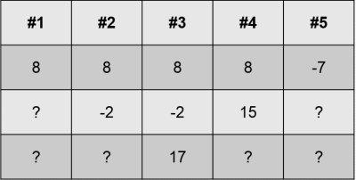

# Стековые вычисления на языке C++

### Задачи

- **(1.1)** переписать код так, чтобы вместо кода в стиле C был класс CStackMachine. При переполнении стека должно выбрасываться исключение типа `std::out_of_range`. Интерфейс класса можно сделать таким:
```cpp
class CStackMachine
{
public:
    void Push(int value);
    void Pop();
    void Add();
    void Multiply();
    void Substract();
    void Divide();
    void Dump();

private:
    std::vector<int> m_stack;
};
```

- **(1.2)** переписать [лабораторную с калькулятором](calculator.md) так, чтобы калькулятор генерировал код, который программа stackmachine может выполнить.

### Принцип стековых вычислений

Стековые виртуальные машины &mdash; самые распространённые. Например, виртуальные машины CLR и JVM являются стековыми. Это значит, что любой компилятор под платформу JVM (включая компиляторы Java, Groovy, Kotlin, Scala и других языков) должен генерировать код, использующий стековую машину для вычисления выражений.

Все современные ассемблеры и промежуточные языки компиляторов содержат понятие "стек", и на них можно писать код в стиле стековой машины. Условно, это выглядит так:

```vb
push 8
push -2
push 17
add
sub
```

1. После первых трёх команд стек будет содержать три значения: [8, -2, 17].
2. После команды add последние два числа на стеке будут сложены, результат будет положен в предпоследнюю ячейку, а затем последняя ячейка будет выкинута. В итоге стек будет содержать [8, 15].
3. После команды sub из предпоследнего числа на стеке будет вычтено последнее, результат попадёт в предпоследнюю ячейку, а затем последняя ячейка будет выкинута. В итоге стек будет содержать [-7].

Таким образом, мы вычислили выражение `8 - (-2 + 17) = -7`. Это можно проллюстрировать:



### Представление стека

Написать минимальную программу для стековых вычислений очень легко.

1. Объявим массив для хранения данных стека и переменную для хранения индекса вершины
2. Объявим функции push, pop, add и т.д.
3. Не забудьте определить переменные в файле `stackvm.cpp`.

##### stackvm.h
```cpp
#pragma once

static const int STACK_SIZE = 1000;
extern int g_stackVM[STACK_SIZE];
extern int g_stackVMTop;

void push(int value);
void pop();
void add();
void multiply();
void substract();
void divide();

void printStackAll();
```

Функции `printStackAll()` и `printStackTop()`, в отличие от остальных, не имеют отношения к вычислениям. Они просто печатают содержимое стека:
```cpp
void printStackAll()
{
    puts("--- stack begin ---");
    for (int i = 0, n = g_stackVMTop; i <= n; ++i)
    {
        const int value = g_stackVM[i];
        printf("%d. %d\n", i, value);
    }
    puts("--- stack end ---");
}

void printStackTop()
{
    const int value = g_stackVM[g_stackVMTop];
    printf("%d\n", value);
}
```

### Опасные места

При работе со стеком есть две опасных ситуации:

- переполнение стека (stack overflow)
- уход ниже стека (stack underflow)

Если при исполнении программы на микропроцессоре возникнет stack overflow или stack underflow для стека потока ОС, то, скорее всего, ОС убьёт весь провинившийся процесс со всеми потоками. В нашем стеке мы будем проверять stack underflow, и в случае проблем вызывать стандартную функцию `abort();`:

##### добавить в stackvm.cpp
```cpp
static void check_underflow(int reserve)
{
    if (g_stackVMTop < reserve)
    {
        fprintf(stderr, "stack underflow\n");
        abort();
    }
}
```

### Push и pop

1. Функция push должна получать целое число, которое следует положить на стек
2. Функция pop не имеет аргументов, зато проверяет stack underflow
3. Функции для арифметических операций также проверяют stack underflow, т.к. два операнда они берут из стека.

##### добавить в stackvm.cpp
```cpp
void push(int value)
{
    g_stackVM[++g_stackVMTop] = value;
}

void pop()
{
    check_underflow(0);
    --g_stackVMTop;
}

void add()
{
    check_underflow(1);
    g_stackVM[g_stackVMTop - 1] = g_stackVM[g_stackVMTop - 1] + g_stackVM[g_stackVMTop];
    --g_stackVMTop;
}

void multiply()
{
    check_underflow(1);
    g_stackVM[g_stackVMTop - 1] = g_stackVM[g_stackVMTop - 1] * g_stackVM[g_stackVMTop];
    --g_stackVMTop;
}

void substract()
{
    check_underflow(1);
    g_stackVM[g_stackVMTop - 1] = g_stackVM[g_stackVMTop - 1] - g_stackVM[g_stackVMTop];
    --g_stackVMTop;
}

void divide()
{
    check_underflow(1);
    g_stackVM[g_stackVMTop - 1] = g_stackVM[g_stackVMTop - 1] / g_stackVM[g_stackVMTop];
    --g_stackVMTop;
}
```

### Используем стек

Вот пример кода, использующего написанную нами стековую машину для вычислений:
##### main.cpp
```cpp
#include <stack.h>

int main(int , char *[])
{
    // natural notation: 7 + 13 / 3 * 10
    // reverse polish notation: 7, 13, 3, /, 10, *, +
    // expected result: 47

    push(7);
    push(13);
    push(3);
    divide();
    push(10);
    multiply();
    add();

    printStackAll();

    return 0;
}
```
##### вывод
```
--- stack begin ---
0. 47
--- stack end ---
```

Из комментариев в примере легко понять заметить, как произвольную формулу превратить в код для стековой машины. Алгоритм:

1. берём выражение, например `7 + 13 / 3 * 10`
2. переписываем его в обратной польской нотации `7 13 3 / 10 * +`
3. транслируем каждое число в команду `push N`, а каждый оператор - в соответствующую вычисляющую команду
4. в конце вызываем `printStackTop` для печати вершины стека

### Читаем команды из консоли

Теперь мы сделаем поддержку чтения и выполнения команд в следующем формате:
```cpp
push 7
push 13
push 3
div
push 10
mul
add
```

- Чтобы не создавать класс сканера, мы применим возможности функций scanf/sscanf/fscanf.
- Функции scanf/sscanf/fscanf принадлежат стандартной библиотеке C. Чтобы найти их документацию, достаточно набрать в Google `man scanf`.
- Чтобы сделать функцию `execute` более гибкой, передадим в неё `FILE*`. Чтобы читать с консоли, достаточно будет вызвать функцию с параметром `stdin`, пример:  `execute(stdin);`

##### скелет функции execute()
```cpp
void execute(FILE *input)
{
    int value = 0;
    char command[100];
    for (;;)
    {
        value = 0;
        int matchCount = fscanf(input, "%99s %d", command, &value);
        switch (matchCount)
        {
        case EOF:
        case 0:
        case 1:
        case 2:
            break;
        }
    }
}
```

В нашем случае scanf может вернуть один из 4-х кодов документации: EOF, 0, 1 или 2.

- согласно документации, EOF означает ошибку либо конец файла. Проверить, что именно произошло, можно функцией `ferror(FILE *file)`.
- значения 0, 1 и 2 показывают, сколько аргументов `scanf` удалось распарсить и записать
- есть нюанс: при тестировании приложения в консоли scanf будет ожидать ввода целого числа и из-за этого отставать на 1 аргумент. То есть, после ввода "push 10 pop" команда pop не будет прочитана, пока не появится конец файла или следующая строка

Зная это, можем улучшить обработку ошибок:

##### Обработка кодов возврата scanf
```cpp
switch (matchCount)
{
case EOF:
    if (ferror(input))
    {
        throw std::runtime_error("input reading error");
    }
    return;
case 0:
    throw std::logic_error("unexpected scan error");
case 1:
    // call command (value == 0).
    break;
case 2:
    // call command (value read from input).
    break;
}
```

Код, использующий функцию, мог бы выглядеть так (не забывайте, что main возвращает ненулевое значение при ошибке):
```cpp
int main(int /*argc*/, char */*argv*/[])
{
    try
    {
        execute(stdin);
        printStackTop();
    }
    catch (std::exception const& ex)
    {
        puts(ex.what());
        return 1;
    }

    return 0;
}
```

Теперь мы могли бы сравнивать строки и вызывать команды для кодов возврата 1 и 2. Но чтобы сократить код, мы применим приём функционального программирования: поместим функции в контейнер `std::map`.

##### Функции в std::map
```cpp
void execute(FILE *input)
{
    int value = 0;
    char command[100];
    std::map<std::string, std::function<void()>> commands = {
        {"push", std::bind(push, std::cref(value))},
        {"pop", pop},
        {"add", add},
        {"mul", multiply},
        {"sub", substract},
        {"div", divide}
    };
    // [...]
```

Обработка становится предельно простой (учтите, что `std::map::at()` может бросать исключение `std::out_of_range`, если ключа нет в словаре)
```cpp
// [...]
case 1:
case 2:
{
    auto action = commands.at(command);
    action();
}
    break;
```

Теперь можно вызывать программу командой `"stackmachine < commands.txt"`, где commands.txt, например, такой:
```
push 8
push 3
push 17
add
sub
```

### Читать далее

- [Обратная польская запись (ru.wikipedia.org)](https://ru.wikipedia.org/wiki/%D0%9E%D0%B1%D1%80%D0%B0%D1%82%D0%BD%D0%B0%D1%8F_%D0%BF%D0%BE%D0%BB%D1%8C%D1%81%D0%BA%D0%B0%D1%8F_%D0%B7%D0%B0%D0%BF%D0%B8%D1%81%D1%8C)
- [Два типа виртуальных машин (security-corp.org)](http://security-corp.org/programming/27437-dva-mira-virtualnyh-mashin.html)
- [SSA-форма]
- [LLVM-IR]
