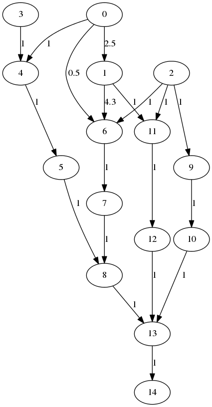
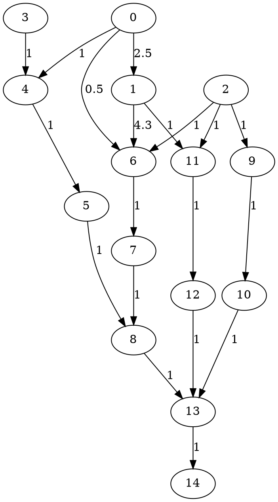

# Визуализация графов с boost.graph и Graphviz

В составе библиотек boost есть модуль boost.graph, дающий средства для хранения графов, обработки графов и вывода их в файл формата `.dot`.

`.dot` &mdash; это формат консольной утилиты Graphviz, существующей ещё с 80-х годов, со времён Unix System V. В наше время утилита Graphviz кроссплатформенная, прекрасно работает под Windows, OSX и Linux. Она позволяет по простым текстовым описаниям на языке Graphviz генерировать такие диаграммы:



Писать на языке Graphviz вручную незачем, благодаря модулю boost.graph, умеющему генерировать Graphivz-код из графа в оперативной памяти.

## Установка

Для Windows потребуется:

- установить Graphviz из MSI-пакета: http://www.graphviz.org/Download_windows.php
- добавить в системную переменную PATH путь к Graphviz (см. поддиректорию `Graphviz2.38\bin` внутри `Program Files`)
- собрать Boost для Visual Studio 2013 или 2015
- в сборке boost могут помочь [эта статья](http://dev.mindillusion.ru/boost/) и [этот вопрос (stackoverflow.com)](http://stackoverflow.com/questions/31566807/how-to-build-boost-version-1-58-0-using-visual-studio-2015-enterprise)


Для Ubuntu потребуется:

- установить пакеты dot, libboost-graph-dev

## Берём пример

В примере мы создадим граф из 15 вершин и запишем в файл `test.dot`. Пример взят [отсюда (snipplr.com)](http://snipplr.com/view/6056/). Были сделаны доработки:

- вместо `boost::write_graphviz` теперь вызывается `boost::write_graphviz_dp`, это результат изменений внутри библиотеки boost
- массивы в стиле языка C заменены на `std::vector`
- вместо `typedef` использован более современный `using`.
- индексы вершин уменьшены на единицу, чтобы убрать с картинок нулевую вершину.
- для вывода надписей на переходах добавлена строка:

```cpp
dp.property("label", get(edge_weight, graph));
```

## Используем boost.graph

Из библиотеки boost нам нужны три заголовка:
```cpp
#include <boost/graph/graphviz.hpp>
#include <boost/graph/adjacency_list.hpp>
#include <boost/graph/iteration_macros.hpp>
```

Нам пригодятся несколько заголовков STL:
```cpp
#include <string>
#include <fstream>
#include <algorithm>
```  

При сборке в Visuals Studio следует добавить в `stdafx.h` макрос для отключения лишних предупреждений о якобы небезопасной функции `std::fill`:
```cpp
#define _SCL_SECURE_NO_WARNINGS
```

- В качестве рёбер графа будет выступать `std::pair<int, int>` под псевдонимом `Edge`. В целом, библиотека boost.graph работает с разными видами рёбер благодаря реализации на шаблонах.
- Мы также укажем отдельно массив весов для каждой вершины
- Для хранения как списка вершин, так и списка рёбер (переходов) у каждой вершины мы используем `std::vector`. Для этого первым и вторым параметрами шаблона `boost::adjacency_list` указан `boost::vecS`.  Как вариант, мы могли бы использовать `std::list`, указав параметр `boost::listS`.

## Листинг функции
```cpp
void makeSimpleDot()
{
	using Edge = std::pair<int, int>;
	using Graph = boost::adjacency_list< boost::vecS, boost::vecS, boost::directedS,
		boost::property< boost::vertex_color_t, boost::default_color_type >,
		boost::property< boost::edge_weight_t, double >
	>;

	const int VERTEX_COUNT = 15;
	std::vector<Edge> edges = {
		{ 0, 4 },{ 0, 6 },{ 0, 1 },{ 1, 6 },{ 1, 11 },
		{ 2, 6 },{ 2, 9 },{ 2, 11 },{ 3, 4 },{ 4, 5 },
		{ 5, 8 },{ 6, 7 },{ 7, 8 },{ 8, 13 },
		{ 9, 10 },{ 10, 13 },{ 11, 12 },{ 12, 13 },{ 13, 14 },
	};
	std::vector<double> weights(edges.size());
	std::fill(weights.begin(), weights.end(), 1.0);
	weights[1] = 0.5;
	weights[2] = 2.5;
	weights[3] = 4.3;

	Graph graph(edges.begin(), edges.end(), weights.begin(), VERTEX_COUNT);

	boost::dynamic_properties dp;
	dp.property("weight", boost::get(boost::edge_weight, graph));
	dp.property("label", boost::get(boost::edge_weight, graph));
	dp.property("node_id", boost::get(boost::vertex_index, graph));
	std::ofstream ofs("test.dot");
	boost::write_graphviz_dp(ofs, graph, dp);
}
```

## Выходной файл test.dot



## Вызов Graphviz для визуализации

Graphviz поддерживает множество выходных форматов, выбирать их можно по имени аргументом командной строки "-Tformat", например, `-Tsvg`. Если вы ошиблись в названии формата &mdash; Graphviz выдаст список доступных имён.

Пример: у вас есть граф в файле test.dot, и вы хотите получить PNG с названием `dia.png`.

##### Команда вызова Graphviz
```bash
dot -Tpng -odia.png test.dot
```

##### Результат (dia.png)


## Читать далее

Примеры применения обобщённой библиотеки boost.graph:

- [пример с ручной настройкой графа (stackoverflow.com)](stackoverflow.com/questions/29312444/how-to-write-graphviz-subgraphs-with-boostwrite-graphviz)
- [примёр со структурами Vertex и Edge (stackoverflow.com)](http://stackoverflow.com/questions/9181183/how-to-print-a-boost-graph-in-graphviz-with-one-of-the-properties-displayed)
- [примёр со структурами DotVertex и DotEdge (stackoverflow.com)](http://stackoverflow.com/questions/29898195/boostread-graphviz-how-to-read-out-properties)
