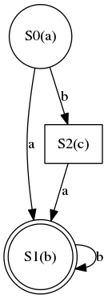
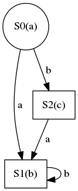

# Пример разбора автомата Мура

## Установка

Для Windows потребуется:

- установить Graphviz из MSI-пакета с сайта [graphviz.org](http://www.graphviz.org/Download_windows.php)
- добавить в системную переменную PATH путь к Graphviz (полный путь к поддиректории `Graphviz2.38\bin` внутри `Program Files`)


Для Ubuntu потребуется:

- установить пакет dot

## Автоматизируем вызов Graphviz

Для автоматизации нам потребуется кроссплатформенный способ запуска внешнего процесса из C++. Например, функции `popen`/`pclose` из стандарта POSIX.

На Windows название функции `popen` изменено на `_popen`. Это легко исправить с помощью препроцессора:

##### макрозамена popen/pclose
```cpp
#ifdef _WIN32
#define popen _popen
#define pclose _pclose
#endif
```  

Используя [пример из документации (msdn.microsoft.com)](https://msdn.microsoft.com/en-us/library/96ayss4b.aspx), можно реализовать функцию для запуска произвольной команды, печати вывода в консоль и возврата true/false при успешном/неуспешном выполнении.

##### объявление класса CUtils

```cpp
#pragma once

#include <string>

class CUtils
{
public:
    CUtils() = delete;

    static bool RunProcess(std::string const& command);
};
```

##### запуск внешней команды в CUtils::RunProcess
```cpp
bool CUtils::RunProcess(const std::string &command)
{
	CPipeHandle pipe(popen(command.c_str(), "r"));
	if (!pipe)
	{
		return false;
	}

	std::vector<char> buffer(256);

	while (std::fgets(buffer.data(), int(buffer.size()), pipe))
	{
		std::fputs(buffer.data(), stderr);
	}

	if (std::feof(pipe))
	{
		return true;
	}

	// process run failed, print error.
	std::fputs(std::strerror(errno), stderr);
	return false;
}
```

Класс CPipeHandle &mdash; это простейшая безопасная обёртка над `FILE*`, в деструкторе которой автоматически вызывается закрытие канала через `pclose`.

##### RAII-обёртка для FILE*
```cpp
namespace
{
class CPipeHandle
{
public:
	CPipeHandle(FILE *pipe)
		: m_pipe(pipe)
	{
	}

	~CPipeHandle()
	{
		if (m_pipe)
		{
			pclose(m_pipe);
		}
	}

	operator FILE*()const
	{
		return m_pipe;
	}

private:
	FILE *m_pipe = nullptr;
};
}
```

Чтобы воспользоваться API, нужно указать полную команду со всеми аргументами. Если путь к исполняемому файлу команды не добавлен в переменную окружения PATH, то придётся указать полный путь к `.exe`. Вот пример вызова Graphviz для преобразования диаграммы `fsm.dot` в изображение `fsm.png`
```cpp
CUtils::RunProcess("dot -Tpng -ofsm.png fsm.dot");
```

Отлично, теперь осталось только подготовить `fsm.dot`.

## Класс MooreTable.

- В английском языке автоматы Мили и Мура называются "Meale" и "Moore". Поэтому, класс назовём MooreTable.
- В автомате Мура каждое состояние имеет выходной сигнал (появляется при переходе в состояние).
- Каждый переход в другое состояние происходит при определённом входном сигнале.

Таким образом, диаграмма автомата Мура &mdash; это ориентированный граф, вершины которого (состояния) содержат выходной сигнал, а рёбра &mdash; входной сигнал, вызывающий переход в новое состояние.



##### объявление класса CMooreTable

```cpp
// Moore table
// each state (graph vertex) has char output.
// each transition (graph edge) has char input.
class CMooreTable : public IFsmTable
{
public:
	struct State
	{
		std::map<char, size_t> transitions;
		char output;
	};

	void Read(std::istream & in) override;
	void WriteGraphviz(std::ostream & out)const override;

private:
	std::vector<State> m_states;
};
```

Для большей гибкости, класс наследуется от интерфейса IFsmTable. Это упростит добавление автоматов Мили.

##### интерфейс IFsmTable
```cpp
class IFsmTable
{
public:
	virtual ~IFsmTable() = default;
	virtual void Read(std::istream & in) = 0;
	virtual void WriteGraphviz(std::ostream & out)const = 0;
};
```

### Чтение автомата Мура из файла

Спецификация формата взята из [1-й лабораторной](../tasks/fsm.md).

- на первой строке записано "`<MR>`"
- на второй строке два числа: количество состояний `V` и количество переходов `N`.
- на третьей строке `V` символов через пробел, это выходные символы для каждого состояния 1-го до `V`-го
- на последующих `N` строках записаны переходы в формате "`x y z`", где x &mdash; индекс исходного состояния, y &mdash; входной символ (буква из латинницы), z &mdash; индекс нового состояния.

Пример ввода:
```
<MR>
3 4
a b c
0 a 1
0 b 2
1 b 1
2 a 1
```

Опираясь на спецификацию, можно разработать следующий парсер:
##### парсер автомата Мура (без обработки ошибок)
```cpp
void CMooreTable::Read(std::istream &in)
{
	size_t stateCount = 0;
	size_t rowsCount = 0;
	in >> stateCount >> rowsCount;
	m_states.resize(stateCount);

	for (size_t si = 0; si < stateCount; ++si)
	{
		in >> m_states[si].output;
	}

	for (size_t ri = 0; ri < rowsCount; ++ri)
	{
		size_t stateFrom = 0;
		size_t stateTo = 0;
		char input = '\0';
		in >> stateFrom >> input >> stateTo;

		State &state = m_states[stateFrom];
		state.transitions[input] = stateTo;
	}
}
```

## Генерация кода для Graphviz

На выходе мы должны получить примерно такой файл `*.dot`:

```
digraph G {
0 [shape="circle"label="S0(a)"];
1 [shape="box"label="S1(b)"];
2 [shape="box"label="S2(c)"];
0->1 [label=" a "];
0->2 [label=" b "];
1->1 [label=" b "];
2->1 [label=" a "];
}
```

В файле указаны надписи на вершинах и рёбрах графа, где под вершинами подразумеваются состояния, а под рёбрами &mdash; переходы. Для вершин указана форма: для начального состояния круг (circle), для конечных состояний (терминалов) двойной круг (doublecircle), для промежуточных состояний (нетерминалов) прямоугольник (box).

Для удобства вывода заведём вспомогательный класс CDotWriter.

##### файл DotWriter.h
```cpp
enum class StateType
{
	Initial,
	Nonterminal,
	Terminal
};

class CDotWriter
{
public:
	CDotWriter(std::ostream & out);
	~CDotWriter();

	void PrintVertex(size_t index, std::string const& label, StateType type = StateType::Nonterminal);
	void PrintEdge(size_t from, size_t to, std::string const& label);

private:
	std::string GetShape(StateType type)const;

	std::ostream & m_out;
};
```

##### файл DotWriter.cpp
```cpp
CDotWriter::CDotWriter(std::ostream &out)
	: m_out(out)
{
	m_out << "digraph G {\n";
}

CDotWriter::~CDotWriter()
{
	m_out << "}\n";
}

void CDotWriter::PrintVertex(size_t index, const std::string &label, StateType type)
{
	m_out << index << " [";
	m_out << "shape=\"" << GetShape(type) << "\"";
	m_out << "label=\"" << label << "\"];\n";
}

void CDotWriter::PrintEdge(size_t from, size_t to, const std::string &label)
{
	m_out << from << "->" << to << " [label=\" " << label << " \"];\n";
}

std::string CDotWriter::GetShape(StateType type) const
{
	switch (type)
	{
	case StateType::Initial:
		return "circle";
	case StateType::Nonterminal:
		return "box";
	case StateType::Terminal:
		return "doublecircle";
	}
	return std::string();
}
```

Используя этот вспомогательный класс, можно записать следующий метод для вывода автомата Мура в файл `*.dot`:
##### вывод автомата Мура в формат Graphiv
```cpp
void CMooreTable::WriteGraphviz(std::ostream &out)const
{
	CDotWriter writer(out);

	for (size_t si = 0; si < m_states.size(); ++si)
	{
		State const& state = m_states[si];
		StateType type = (si == 0) ? StateType::Initial : StateType::Nonterminal;
		std::string label = "S" + std::to_string(si) + "(" + state.output + ")";
		writer.PrintVertex(si, label, type);
	}
	for (size_t si = 0; si < m_states.size(); ++si)
	{
		State const& state = m_states.at(si);
		for (std::pair<char, size_t> pair : state.transitions)
		{
			std::string label;
			label += pair.first;
			writer.PrintEdge(si, pair.second, label);
		}
	}
}
```

Данная реализация намерено оставлена незаконченной: для состояний-терминалов выбирается неправильное значение `StateType`. Последствия легко увидеть на картинке, где состояние S1 должно быть изображено двойным кругом, а не прямоугольником: 



## Соединяем всё в main.cpp

Оба предложенных нами текстовых формата, для Мили и для Мура, начинаются с идентификатора типа автомата: `<ML>` или `<MR>`. Благодаря этому можно написать функцию, определяющую тип автомата и считывающую автомат:

##### функция ReadFsmTable
```cpp
std::unique_ptr<IFsmTable> ReadFsmTable(std::istream & input)
{
	std::string type;
	input >> type;

	std::unique_ptr<IFsmTable> table;
	if (type == "<MR>")
	{
		table.reset(new CMooreTable);
	}
	else
	{
		return nullptr;
	}
	table->Read(input);
	return table;
}
```

Теперь можно дополнить функцию main, чтобы читать автомат Мура из `input.txt`, писать Graphviz-код в `fsm.dot`, а потом запускать `dot` процесс для получения `fsm.png`. При наличии установленного и добавленного в переменную PATH пакета Graphviz вы получите диаграмму автомата в формате PNG.

##### функция main
```cpp
int main(int argc, char *argv[])
{
	(void)argc;
	(void)argv;

	std::ifstream input("inpu.txt");
	if (!input.is_open())
	{
		std::cout << "Failed to read input file." << std::endl;
		return 1;
	}
	input.close();

	std::unique_ptr<IFsmTable> fsm = ReadFsmTable(input);
	if (!fsm)
	{
		std::cout << "Failed to read FSM table." << std::endl;
		return 1;
	}

	std::ofstream output("fsm.dot");
	fsm->WriteGraphviz(output);
	output.close();

	CUtils::RunProcess("dot -Tpng -ofsm.png fsm.dot");

	return 0;
}
```
