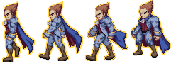

## Искусство владения enum в C++

В играх многие объекты имеют состояния: персонажи двигаются, прыгают, борются или умирают; артефакты появляются и затем манят игрока спецэффектами; заклинания колдуются, летят к цели и в конце воздействуют на неё.



Здесь программисту важны два аспекта:

- процессы (смена спрайтов, анимации, звуковые эффекты)
- состояния (поведение и выбор анимации/звуков)

Для процессов фреймворк предоставляет готовые средства, такие как [cocos2d::Animation](www.cocos2d-x.org/wiki/Sprite_Sheet_Animation) или [CocosDenshion::SimpleAudioEngine](http://www.cocos2d-x.org/reference/native-cpp/V3.3rc0/de/d8f/class_cocos_denshion_1_1_simple_audio_engine.html). Для состояний готовое решение сделать почти невозможно &mdash; и программисту следует реализовать их самостоятельно. Простейший способ &mdash; дать каждому процессу идентификатор, например, число.

```cpp
switch (m_state)
{
case 0:
    // idle state
    break;
case 1:
    // walking state
    break;
case 2:
    // attacking state
    break;
}
```

- В целях замены магических чисел на константы можно дать константам имена, но тогда они всё равно будут выглядеть независимыми значениями. Чтобы подчеркнуть их связанность, можно использовать enum.
- Объектно-ориентированный подход имеет и другие решения этой проблемы, но они требуют введения новых вспомогательных классов и применения расширенных возможностей C++. Для реализации простого персонажа в игре всё это излишнее.

```cpp
// enum "загрязняет" внешнее пространтсво имён, зато может быть неявно приведён к int
// enum class не загрязняет внешнее пространтсво имён, но требует явных приведений к int вместо неявных
enum class UnitState
{
    IDLE,
    WALKING,
    ATTACKING, // запятая на последней строке полезна, чтобы уменьшить число изменяемых строк в git.
};

switch (m_state)
{
case UnitState::IDLE:
    break;
case UnitState::WALKING:
    break;
case UnitState::ATTACKING:
    break;
}
const int numericState = static_cast<int>(m_state);
```
