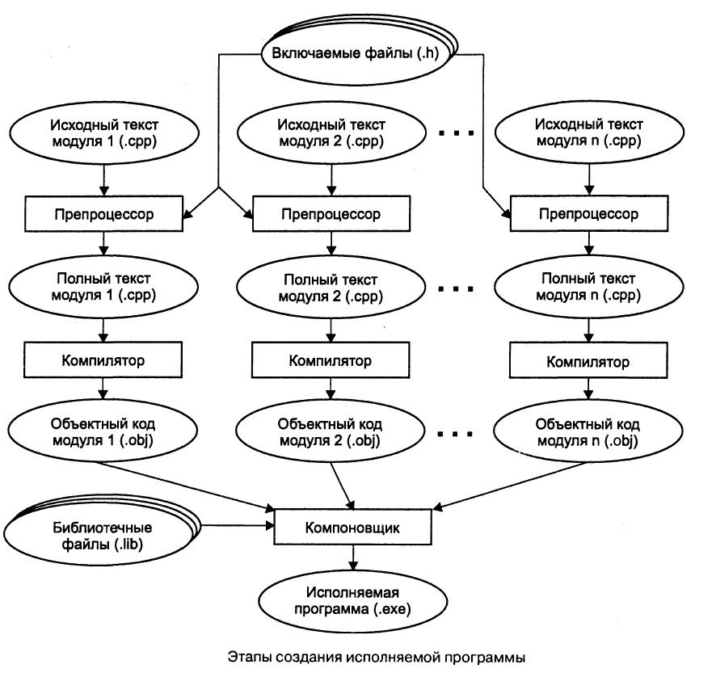

# Что надо знать о C/C++ в рамках курса

Вы должны помнить два базовых принципа, которые действуют в рамках курса:

- пишите код осознанно, не забывая читать документацию языка и библиотек
- будьте готовы исправить код или применить методы рефакторинга

## Императивный стиль

C/C++ полностью поддерживают императивный подход к программированию. Чтобы свободно им пользоваться, надо

- помнить про [фундаментальные типы данных](http://en.cppreference.com/w/cpp/language/types), включая void, целые числа (и особенности их дискретного представления), числа с плавающей точкой (и особенности их дискретного представления), тип char
- уметь пользоваться булевой алгеброй (реализованной в языке для типа bool), помнить о [преобразованиях Де-Моргана](https://ru.wikipedia.org/wiki/%D0%97%D0%B0%D0%BA%D0%BE%D0%BD%D1%8B_%D0%B4%D0%B5_%D0%9C%D0%BE%D1%80%D0%B3%D0%B0%D0%BD%D0%B0), о [Short-Curcuit Evaluation](https://en.wikipedia.org/wiki/Short-circuit_evaluation), о том, как int и float неявно преобразуются в bool
- помнить про [неявный приоритет операторов](http://en.cppreference.com/w/cpp/language/operator_precedence), коммутативность и ассоциативность ряда операторов для примитивных типов

## Структурный стиль

Необходимо:

- помнить про выражение с тернарным оператором `condition ? then_value : else_value`, которое в некоторых случаях может служить заменой `if..else`
- помнить про [инструкцию switch](http://en.cppreference.com/w/cpp/language/switch), которая в некоторых случаях может служить заменой `if..else`
- помнить про все три формы циклов: `while`, `do..while` и `for`, уметь раскладывать одну инструкцию for на три инструкции (одна из которых &mdash; while), а также собирать инструкцию for из while
- помнить про назначение инструкций [continue](http://en.cppreference.com/w/cpp/language/continue) и [break](http://en.cppreference.com/w/cpp/language/break) в циклах, уметь изменять код, заменяя `break` на дополнительную булеву переменную или убирая булеву переменную в пользу `break`.

## Процедурный стиль

C/C++ полностью поддерживают процедурную парадигму программирования. Чтобы свободно ей пользоваться, надо

- помнить, что вызов функции является выражением и потому может быть вложен в выражение: `setPosition(sin(a), cos(a))`
- помнить, что порядок вычисления аргументов при вызове функции не определён стандартом и зависит от платформы
- помнить, что [инструкция return](http://en.cppreference.com/w/cpp/language/return) является терминальной для функции и завершает выполнение как стуктурного блока кода, так и всей функции
- помнить про [особенности функции main](http://en.cppreference.com/w/cpp/language/main_function)
- помнить про [области видимости переменных](http://en.cppreference.com/w/cpp/language/scope)
- иметь представление о [классификации простых и составных типов данных в C/C++](http://en.cppreference.com/w/cpp/language/type), в том числе уметь пользоваться ссылочными типами, указателями, массивами Си, структурами `struct`
- уметь использовать как массивы языка Си, так и стандартный контейнер [std::vector](http://en.cppreference.com/w/cpp/container/vector)
- уметь выбирать между изменяемыми ссылками `T&` и константными ссылками `const T&`, ссылками `T&, const T&` и указателями `T *, const T*`
- знать о понятиях "нулевой указатель", о применении ключевых слов [nullptr](http://en.cppreference.com/w/cpp/language/nullptr), [new](http://en.cppreference.com/w/cpp/language/new), [delete](http://en.cppreference.com/w/cpp/language/delete)
- иметь представление о трёх местах хранения переменных: статическая память, динамическая память, стек потока программы

## Деление программы на модули

Языки C/C++ способствуют разделению кода на интерфейс (заголовочные файлы) и реализацию (файлы `*.c/*.cpp`). Также поддерживается деление программы на отдельные модули, где под модулем программы понимается отдельная пара "заголовочный файл" - "файл реализации". Следует:

- знать, в чём разница между определением (definition) и объявлением (declaration)
- помнить про [One Definition Rule (cppreference.com)](http://en.cppreference.com/w/cpp/language/definition)
- представлять, как ключевые слова `extern` и `static` влияют на класс хранения и компоновку глобальных констант и переменных. Об этом рассказано в [статье на en.cppreference.com](http://en.cppreference.com/w/cpp/language/storage_duration)
- помнить общую схему препроцессинга, комплиляции и компоновки. Об этом рассказано в [вопросе на stackoverflow.com](http://stackoverflow.com/questions/6264249/how-does-the-compilation-linking-process-work)
- помнить о том, что [предкомпилированные заголовки ускоряют компиляцию](https://ru.wikipedia.org/wiki/%D0%9F%D1%80%D0%B5%D0%B4%D0%B2%D0%B0%D1%80%D0%B8%D1%82%D0%B5%D0%BB%D1%8C%D0%BD%D0%BE_%D0%BE%D1%82%D0%BA%D0%BE%D0%BC%D0%BF%D0%B8%D0%BB%D0%B8%D1%80%D0%BE%D0%B2%D0%B0%D0%BD%D0%BD%D1%8B%D0%B5_%D0%B7%D0%B0%D0%B3%D0%BE%D0%BB%D0%BE%D0%B2%D0%BA%D0%B8)
- уметь настраивать предкомпилированные заголовки (хотя бы для одной системы сборки / среды разработки)

Общая схема компиляции:

