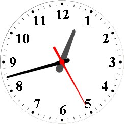

# Задание "Аналоговые Часы"

В рамках задания следует разработать приложение, симулирующее аналоговые часы. Требуется:

- взять исходный пример и запустить его локально
- улучшить структуру исходного кода примера, т.е. совершить *рефакторинг*
- после этого улучшить визуальную составляющую примера
- сделать видеозапись экрана

### Рефакторинг

При рефакторинге следует опираться на

- [Соглашения о стиле кодирования](../coding-style/cpp-style-sfml.md)
- [Статью "Assert. Что это?" (habrahabr.ru)](https://habrahabr.ru/post/141080/)
- [Статью "Game Loop" (англ.)](gameprogrammingpatterns.com/game-loop.html)

Требования:

- соблюдены соглашения о кодировании
- исходный код разделён на отдельные функции размером не более 15 строк кода каждая
- каждая функция выполняет одну осмысленную задачу и имеет осмысленное название в виде английского слова или фразы
- глобальные переменные отсутствуют (всё нужное передаётся в параметрах функций)
- для передачи параметров, которые следует изменить, используются указатели и ссылки
- можно описывать свои структуры данных для уменьшения числа параметров функций, при этом каждая структура должна симулировать некоторую осмысленную сущность, например, циферблат часов.

### Внешний вид

Требования по внешнему виду показаны на картинке:



В том числе:

- должны быть 12 арабских или римских цифр по краями циферблата
- должно быть 60 засечек на циферблате, из них 12 крупнее остальных (т.к. в них попадает часовая стрелка в начале каждого часа)
- отображаемое время совпадает с системным временем
- секундная стрелка должна отличаться по цвету от остальных

### Вспомогательные материалы:

Из книги Стивена Прата "Язык программирования C++. Лекции и упражнения", см. [описание на ozon.ru](http://www.ozon.ru/context/detail/id/7979735/)

- главы 3, 5, 6, 7 как основы языка
- главы 4, 8 для дополнительного чтения

В сети Интернет:

- [Соглашения о стиле кодирования](../coding-style/cpp-style-sfml.md)
- [Связь между декартовыми и полярными координатами (ru.wikipedia.org)](https://ru.wikipedia.org/wiki/%D0%9F%D0%BE%D0%BB%D1%8F%D1%80%D0%BD%D0%B0%D1%8F_%D1%81%D0%B8%D1%81%D1%82%D0%B5%D0%BC%D0%B0_%D0%BA%D0%BE%D0%BE%D1%80%D0%B4%D0%B8%D0%BD%D0%B0%D1%82#.D0.A1.D0.B2.D1.8F.D0.B7.D1.8C_.D0.BC.D0.B5.D0.B6.D0.B4.D1.83_.D0.B4.D0.B5.D0.BA.D0.B0.D1.80.D1.82.D0.BE.D0.B2.D1.8B.D0.BC.D0.B8_.D0.B8_.D0.BF.D0.BE.D0.BB.D1.8F.D1.80.D0.BD.D1.8B.D0.BC.D0.B8_.D0.BA.D0.BE.D0.BE.D1.80.D0.B4.D0.B8.D0.BD.D0.B0.D1.82.D0.B0.D0.BC.D0.B8)

## Исходный пример

Исходный пример взят [со страницы на SFML Wiki](https://github.com/SFML/SFML/wiki/Source:-Analog-Clock)

Ресурсы:

- звук движения стрелок: [opengameart.org/content/ticking-clock-0](http://opengameart.org/content/ticking-clock-0)
- любое фоновое изображение

```cpp
////////////////////////////////////////////////////////////
// Headers:
// ctime for getting system time and
// cmath for sin and cos functions
////////////////////////////////////////////////////////////
#include <SFML/Graphics.hpp>
#include <SFML/Audio.hpp>
#include <ctime>
#include <cmath>


////////////////////////////////////////////////////////////
/// Entry point of application
///
/// \return Application exit code
///
////////////////////////////////////////////////////////////
int main()
{
    // Define some variables and constants
    const int screenWidth = 800;
    const int screenHeight = 600;
    const float PI = 3.1415927;
    const int clockCircleSize = 250;
    const int clockCircleThickness = 2;
    int x, y;
    float angle = 0.0;

    // Set multisampling level
    sf::ContextSettings settings;
    settings.antialiasingLevel = 8;

    // Create the window of the application
    sf::RenderWindow window(sf::VideoMode(screenWidth, screenHeight), "SFML Analog Clock", sf::Style::Close, settings);

    // Define windowCenter which gets the center of the window here, right after creating window
    sf::Vector2f windowCenter = sf::Vector2f(window.getSize().x / 2.0f, window.getSize().y / 2.0f);

    // Create a list for clock's dots
    sf::CircleShape dot[60];

    // Create dots and place them to very right positions
    for (int i=0; i<60; i++)
    {
        x = (clockCircleSize - 10) * cos(angle);
        y = (clockCircleSize - 10) * sin(angle);

        if (i%5 == 0)
            dot[i] = sf::CircleShape(3);
        else
            dot[i] = sf::CircleShape(1);
        dot[i].setFillColor(sf::Color::Black);
        dot[i].setOrigin(dot[i].getGlobalBounds().width / 2, dot[i].getGlobalBounds().height / 2);
        dot[i].setPosition(x + window.getSize().x / 2, y + window.getSize().y / 2);

        angle = angle + ((2 * PI)/60 );
    }

    // Create outline of the clock
    sf::CircleShape clockCircle(clockCircleSize);

    clockCircle.setPointCount(100);
    clockCircle.setOutlineThickness(clockCircleThickness);
    clockCircle.setOutlineColor(sf::Color::Black);
    clockCircle.setOrigin(clockCircle.getGlobalBounds().width / 2, clockCircle.getGlobalBounds().height / 2);
    clockCircle.setPosition(window.getSize().x / 2 + clockCircleThickness, window.getSize().y / 2 + clockCircleThickness);

    // Crate another circle for center
    sf::CircleShape centerCircle(10);

    centerCircle.setPointCount(100);
    centerCircle.setFillColor(sf::Color::Red);
    centerCircle.setOrigin(centerCircle.getGlobalBounds().width / 2, centerCircle.getGlobalBounds().height / 2);
    centerCircle.setPosition(windowCenter);

    // Create hour, minute, and seconds hands
    sf::RectangleShape hourHand(sf::Vector2f(5, 180));
    sf::RectangleShape minuteHand(sf::Vector2f(3, 240));
    sf::RectangleShape secondsHand(sf::Vector2f(2, 250));

    hourHand.setFillColor(sf::Color::Black);
    minuteHand.setFillColor(sf::Color::Black);
    secondsHand.setFillColor(sf::Color::Red);

    hourHand.setOrigin(hourHand.getGlobalBounds().width / 2, hourHand.getGlobalBounds().height - 25);
    minuteHand.setOrigin(minuteHand.getGlobalBounds().width / 2, minuteHand.getGlobalBounds().height - 25);
    secondsHand.setOrigin(secondsHand.getGlobalBounds().width / 2, secondsHand.getGlobalBounds().height - 25);

    hourHand.setPosition(windowCenter);
    minuteHand.setPosition(windowCenter);
    secondsHand.setPosition(windowCenter);

    // Create sound effect
    sf::Music clockTick;
    if (!clockTick.openFromFile("resources/clock-1.wav"))
        return EXIT_FAILURE;
    clockTick.setLoop(true);
    clockTick.play();

    // Use a part of SFML logo as clock brand
    sf::Texture clockBrand;
    if (!clockBrand.loadFromFile("resources/clock-brand.png"))
    {
        return EXIT_FAILURE;
    }

    sf::Sprite clockBrandSprite;
    clockBrandSprite.setTexture(clockBrand);
    clockBrandSprite.setOrigin(clockBrandSprite.getTextureRect().left + clockBrandSprite.getTextureRect().width/2.0f,
                             clockBrandSprite.getTextureRect().top + clockBrandSprite.getTextureRect().height/2.0f);

    clockBrandSprite.setPosition(window.getSize().x/2, window.getSize().y -100);


    // Create clock background
    sf::Texture clockImage;
    if (!clockImage.loadFromFile("resources/clock-image.png"))
    {
        return EXIT_FAILURE;
    }

    clockCircle.setTexture(&clockImage);
    clockCircle.setTextureRect(sf::IntRect(40, 0, 500, 500));

    while (window.isOpen())
    {
        // Handle events
        sf::Event event;
        while (window.pollEvent(event))
        {
            // Window closed: exit
            if (event.type == sf::Event::Closed)
                window.close();
        }

        // Get system time
        std::time_t currentTime = std::time(NULL);

        struct tm * ptm = localtime(&currentTime);

        hourHand.setRotation(ptm->tm_hour*30 + (ptm->tm_min/2) );
        minuteHand.setRotation(ptm->tm_min*6 + (ptm->tm_sec/12) );
        secondsHand.setRotation(ptm->tm_sec*6);

        // Clear the window
        window.clear(sf::Color::White);

        // Draw all parts of clock
        window.draw(clockCircle);

        for (int i=0; i<60; i++)
        {
            window.draw(dot[i]);
        }

        window.draw(clockBrandSprite);
        window.draw(hourHand);
        window.draw(minuteHand);
        window.draw(secondsHand);
        window.draw(centerCircle);

        // Display things on screen
        window.display();
    }

    return EXIT_SUCCESS;
}
```
